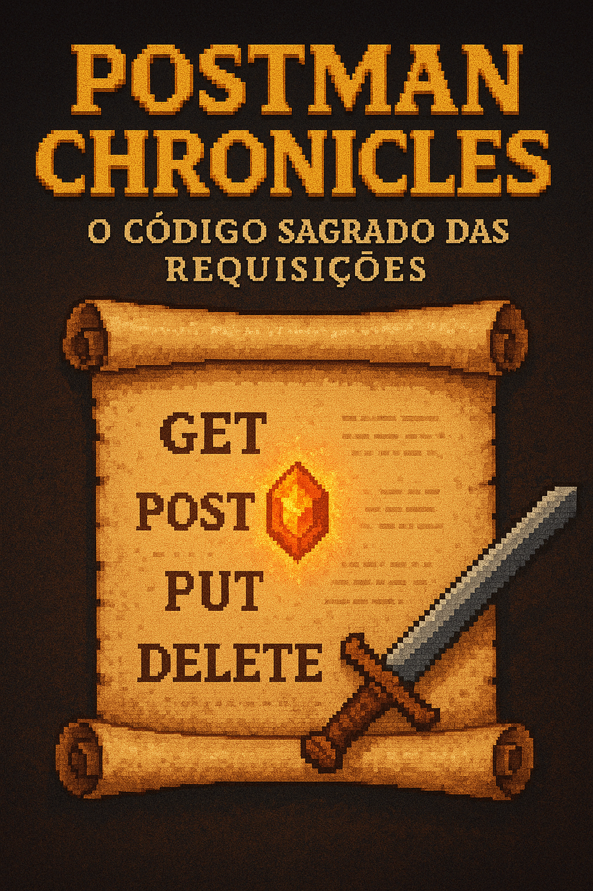

    

-------

# Projeto EBOOK Gerado por I.A.s

 > ℹ️ **NOTE:** Este é o repositório desenvolvido durante o curso no qual fui aluno na plataforma da [DIO](https://dio.me)

Projeto com o objetivo de gerar um ebook digital com as facilidades das ferramentas de IA. todos os prompts
seguem abaixo.

<a href="https://github.com/felipeAguiarCode/prompts-recipe-to-create-a-ebook/blob/main/output/Ebook-Backend.pdf" title="View PDF now"> 📕Clique aqui para ler</a>

## 💻 Tecnologias utilizadas no projeto

- [ChatGPT](https://chat.openai.com/) 
- [GoogleSlide](https://docs.google.com/presentation)

## 🧠 Prompts

ChatGPT：

|   Ação   | prompt                                                                                                                                                                                                                                                                         |
| :------: | ------------------------------------------------------------------------------------------------------------------------------------------------------------------------------------------------------------------------------------------------------------------------------ |
|  título  | Crie titulos para um ebook sobre o nicho de backend mas o ebook vai ser sobre uma ferramenta muito utilizada no desenvolvimento backend que e o postman utilize referencias a jogos e a o mundo nerd, os titulos tem que curtos e cativantes para chamar atenção, cria 5 titulos diferentes.                                                        |
| conteúdo | Escolhi o titulo ("Nome do Titulo Escolhido") crie uma capa baseada nesse titulo para o meu ebook, utilizando nao so o titulo como referencia mas tambem um pergaminho de jogos de rpg aberto em pizel art, pode ter escrito no pergaminho os verbos de Http para apis fazendo referencia ao postman e backend. |

ChatGpt4(Imagem)：

|  Ação  | prompt                                                                                 |
| :----: | -------------------------------------------------------------------------------------- |
| título | Escolhi o titulo ("Nome do Titulo Escolhido") crie uma capa baseada nesse titulo para o meu ebook, utilizando nao so o titulo como referencia mas tambem um pergaminho de jogos de rpg aberto em pixel art, pode ter escrito no pergaminho os verbos de Http para apis fazendo referencia ao postman e backend.|

## ✨ Features

- Conteúdo gerado via ChatGPT
- Imagens geradas via ChatGPT

## 📚 Materiais

- Imagens utilizadas em `assets`
- ebook gerado durante as aulas em `output`

## 🛠️ Instruções de execução

Utilize os prompts acima nas ferramentas sugeridas para gerar o material base e utilize uma ferramenta de edição de documentos como power point, libreoffice , indesign para diagramação.

## 👨‍💻 Expert

    
    
&nbsp&nbsp&nbspFelipe Aguiar 
    &nbsp&nbsp&nbsp
    <a href="https://github.com/felipeAguiarCode">
    GitHub</a>&nbsp;|&nbsp;
    <a href="www.linkedin.com/in/
felipe-exe">LinkedIn</a>
&nbsp;|&nbsp;
    <a href="https://www.instagram.com/felipeaguiar.exe/">
    Instagram</a>
&nbsp;|&nbsp;

  

---

⌨️ com 💜 por [Felipe Aguiar](https://github.com/felipeAguiarCode)
